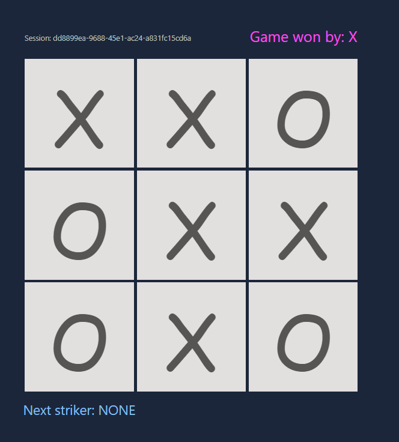

# Tic-Tac-Toe - Game frontend

## Introduction

---
A simple ReactJS frontend application that works in collaboration with [tick-tac-toe-api](https://github.com/pubudusitinamaluwa/tic-tac-toe-api) 
as the backend API for the game.

Read about the game: https://en.wikipedia.org/wiki/Tic-tac-toe

## Build & Run

---
### Frontend
#### Run locally
Clone the repository
```shell
git clone https://github.com/pubudusitinamaluwa/tic-tac-toe
```
Run npm install
```shell
cd tic-tac-toe
npm install
```
Start the application
```shell
npm start
```

> *Make sure the backend is up and running.*

#### With docker
Build the image
```shell
cd tic-tac-toe
docker build -t tic-tac-toe:latest .
```
Run container and bind to port 3000 on host
```shell
docker container run -d --rm --name tic-tac-toe -p 3000:3000 tic-tac-toe:latest
```

### Backend
Please follow the build & run steps in this repo [tic-tac-toe-api](https://github.com/pubudusitinamaluwa/tic-tac-toe-api)

# Screenshots

---



